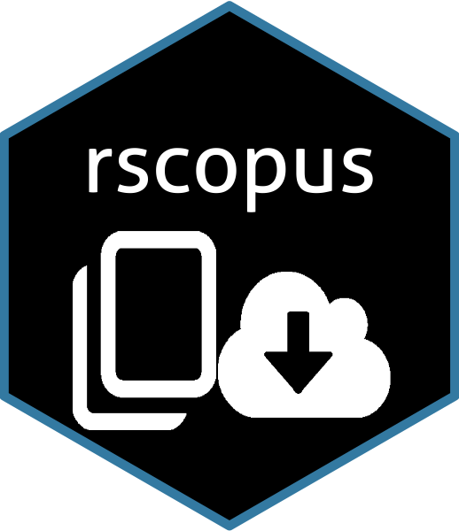

<!-- README.md is generated from README.Rmd. Please edit that file -->

R Package to interface with Elsevier and Scopus APIs

<!--  -->


[](https://travis-ci.org/muschellij2/rscopus)
[](https://ci.appveyor.com/project/muschellij2/rscopus)

# rscopus

The goal of rscopus is to provide an R Scopus Database ‘API’ Interface.

## Installation

You can install rscopus from github with:

``` r
# install.packages("devtools")
devtools::install_github("muschellij2/rscopus")
```

## API Keys

In order to use this package, you need an API key from
<https://dev.elsevier.com/sc_apis.html>. You should login from your
institution and go to Create API Key. You need to provide a website URL
and a label, but the website can be your personal website, and agree to
the terms of service.

You can either get the API key using `option(elsevier_api_key)` or have
it accessible by `api_key = Sys.getenv('Elsevier_API')`. Once you have
it, you can set it using `set_api_key`.

This is a basic example which shows you how to solve a common problem:

``` r
library(rscopus)
res = author_df(last_name = "Muschelli", first_name = "John", verbose = FALSE)
names(res)
#>  [1] "auth_order"            "affilname_1"          
#>  [3] "n_auth"                "affilname_2"          
#>  [5] "n_affils"              "citations"            
#>  [7] "journal"               "description"          
#>  [9] "title"                 "pii"                  
#> [11] "doi"                   "eid"                  
#> [13] "cover_date"            "cover_display_date"   
#> [15] "prism_url"             "dc_identifier"        
#> [17] "dc_creator"            "prism_issn"           
#> [19] "prism_eIssn"           "prism_pageRange"      
#> [21] "dc_description"        "prism_aggregationType"
#> [23] "subtype"               "authkeywords"         
#> [25] "source_id"             "first_name"           
#> [27] "last_name"             "au_id"
head(res[, c("title", "journal", "description")])
#>                                                                                                                                                                         title
#> 1                                    Feasibility of Coping Effectiveness Training for Caregivers of Children with Autism Spectrum Disorder: a Genetic Counseling Intervention
#> 2 Thrombolytic removal of intraventricular haemorrhage in treatment of severe stroke: results of the randomised, multicentre, multiregion, placebo-controlled CLEAR III trial
#> 3                                                                             PItcHPERFeCT: Primary Intracranial Hemorrhage Probability Estimation using Random Forests on CT
#> 4                                                                   ISLES 2015 - A public evaluation benchmark for ischemic stroke lesion segmentation from multispectral MRI
#> 5                                 Large-scale radiomic profiling of recurrent glioblastoma identifies an imaging predictor for stratifying anti-angiogenic treatment response
#> 6      Safety and efficacy of minimally invasive surgery plus alteplase in intracerebral haemorrhage evacuation (MISTIE): a randomised, controlled, open-label, phase 2 trial
#>                         journal      description
#> 1 Journal of Genetic Counseling Article in Press
#> 2                    The Lancet          Article
#> 3          NeuroImage: Clinical          Article
#> 4        Medical Image Analysis          Article
#> 5      Clinical Cancer Research          Article
#> 6          The Lancet Neurology          Article
unique(res$au_id)
#> [1] "40462056100"
unique(as.character(res$affilname_1))
#> [1] "Johns Hopkins Bloomberg School of Public Health"
#> [2] "Departments of Biostatistics"                   
#> [3] "Kennedy Krieger Institute"                      
#> [4] "Johns Hopkins Medical Institutions"             
#> [5] "The Johns Hopkins School of Medicine"
```
